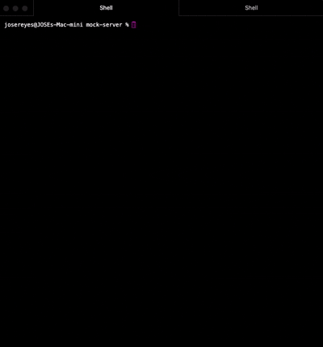
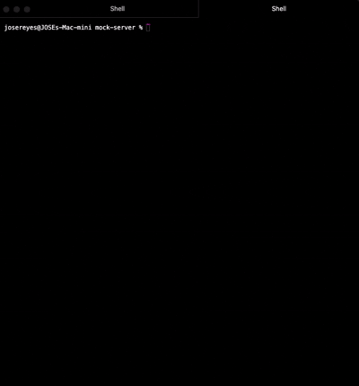
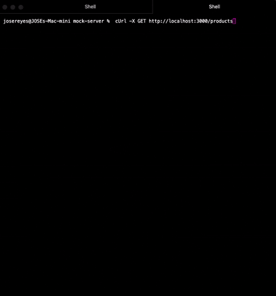
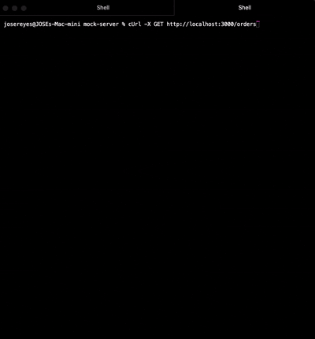

# Mock Server

## Description:

This project sets up a local API mock server using the [json-server](https://www.npmjs.com/package/json-server) library. It serves user, product, and order datasets in JSON format, enabling simulated API requests to various endpoints. Ideal for test automation development without relying on a live backend.

## 🚀 Setup Instructions

- Ensure you have Node.js and Git installed.
- Clone this repository.
- Install dependencies via `npm install`

### Starting the server

From the terminal, start the server via:
`npx json-server db.json`

The server will be accessible via http://localhost:3000.

### API Requests

`GET http://localhost:3000/users`:

`GET http://localhost:3000/products`:

`GET http://localhost:3000/orders`

### Scripts

If you need to generate additional user accounts or orders:

- Navigate to the /scripts folder.
- run `node createUsers.js`
- run `node createOrders.js`

If you'd like to reset the database:

- run `node resetDatabase.js`
