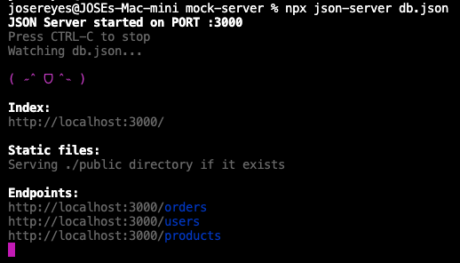

# API Mock Server

## Description: 
This project is a local API JSON mock server built using the [json-server](https://www.npmjs.com/package/json-server) npm library. It provides user, product, and order datasets in JSON format, allowing you to simulate API requests to various endpoints. This is ideal for test automation development without needing a live backend.

### Defining Endpoints and Datasets:
The endpoints and datasets are defined in the projects `db.json` file.

Currently there are 3 endpoints defined (`/users`, `/products`, `/orders`) which return datasets similar to the following: 

`GET /users`: 

```
[
    {
      "id": "x76enmkj236",
      "email": "batman21@batcave.net",
      "firstName": "Bruce",
      "lastName": "Wayne",
      "full_name": "Bruce Wayne",
      "address1": "123 Preston Rd",
      "address2": "",
      "city": "Austin",
      "state": "Texas",
      "zipCode": "78701",
      "phoneNumber": "(512) 369-5000",
      "alternative_phone": "",
      "company": "Bruce Wayne Enterprises",
      "country": "United States"
    },
    {
        ...
    }
]

```
`GET /products`: 

```
[
    {
      "id": "3e253956",
      "productName": "Ashley's Special Smoked Trout",
      "productId": "2e13",
      "cuisine": "Latvian",
      "price": 25
    },
    {
      "id": "4bf6bfa8",
      "productName": "Caprese Salad",
      "productId": "23c4",
      "cuisine": "Malaysian Chinese",
      "price": 89
    }
    ...
]
```

`GET /orders`

```
[{
    "id": "a9512879-66bf-4e2a-abe5-d3d549ae8852",
    "userId": "x76enmkj236",
    "email": "batman21@batcave.net",
    "productName": "Caprese Salad",
    "productId": "23c4",
    "pricePerUnit": 89,
    "quantity": 3,
    "totalPrice": 267
}]
```

Additional endpoints and datasets can be defined to return the desired JSON payloads.

## 🚀 Setup Instructions

- Ensure you have Node.js and Git installed. 
- Clone this repository.
- Install dependencies via `npm install`

### Starting the server
From the terminal, start the server via:
`npx json-server db.json`

The server will be accessible via http://localhost:3000.
The terminal will output the available endpoints, as shown below. 



### Scripts
If you need to generate additional user accounts or orders:
- Navigate to the /scripts folder.
- run `node createUsers.js`
- run `node createOrders.js`

If you'd like to reset the database to the original datasets:
- run `node resetDatabase.js`